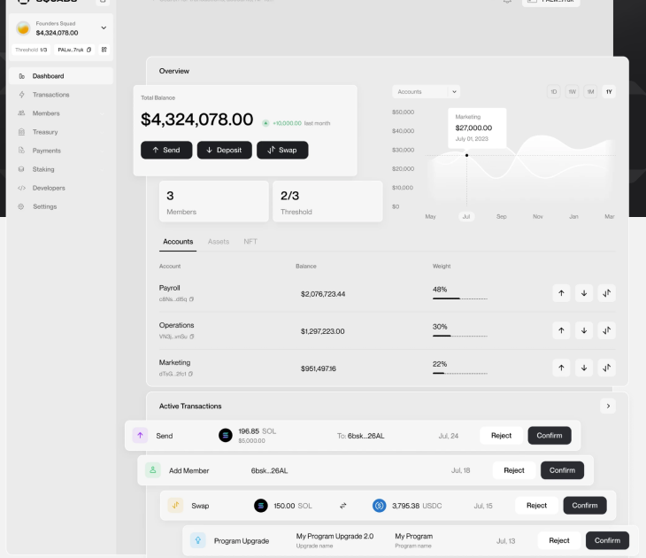

<p align="center">
  
</p>

<h1 align="center">nearvault</h1>

<p align="center">
  <b>Treasury management for NEAR teams: multisig approvals, payments, staking, and DeFi in one dashboard.</b>
</p>

<p align="center">
  <a href="https://nearvault.org">nearvault.org</a> ·
  <a href="docs/onboarding.md">Onboarding guide</a> ·
  <a href="docs/connect-key.md">Connect a key</a>
</p>

<p align="center">
  <a href="LICENSE"></a>
  
</p>



## What is nearvault?

nearvault is an open-source treasury app for teams and companies operating on [NEAR](https://near.org). It wraps NEAR multisig wallets in a clean web UI, so finance workflows that normally require CLI gymnastics become a couple of clicks with an approval trail.

## Features

- **Multisig wallets**: create and manage `*.multisignature.near` wallets with custom signer sets and voting thresholds.
- **Approvals**: every transaction becomes a request that signers confirm or reject from a shared pending-requests queue.
- **Payments**: token transfers with history and a team address book.
- **Teams**: invite members by email; viewers can follow requests without gaining write access to funds.
- **Staking**: stake, unstake, and withdraw from validator pools, including from lockup contracts.
- **Lockups**: create and manage NEAR lockup contracts.
- **DeFi**: swaps, Ref Finance liquidity pools, and stablecoin strategies straight from the treasury.
- **Accounting**: transaction reports for bookkeeping and audits.
- **Signing options**: Ledger hardware wallets or private key.

## Getting started

Prerequisites: Node.js 22+, npm, and a running PostgreSQL instance.

```bash
git clone https://github.com/PierreLeGuen/nearvault.git
cd nearvault
cp .env.example .env       # then fill in the values, see below
npm install
npx prisma migrate dev     # create the database schema
npm run dev
```

The app runs at http://localhost:3000. Required environment variables (see `.env.example` for the full annotated list):

- `DATABASE_URL`: PostgreSQL connection string.
- `GOOGLE_CLIENT_ID` / `GOOGLE_CLIENT_SECRET`: Google OAuth login.
- `EMAIL_SERVER` / `EMAIL_FROM`: SMTP settings for magic-link email login.
- `PIKESPEAK_API_KEY`: [Pikespeak](https://pikespeak.ai) API key for on-chain data.
- `NEXT_PUBLIC_NETWORK_ID`: `mainnet` or `testnet`.

To build without a fully populated environment, set `SKIP_ENV_VALIDATION=1`.

Built with the [T3 stack](https://create.t3.gg/): Next.js, tRPC, Prisma, NextAuth, and Tailwind CSS.

## Documentation

- [Onboarding](docs/onboarding.md): first login, creating a multisig wallet, setting up a team.
- [Connect your key](docs/connect-key.md): Ledger and private key signing.

## Contributing

Issues and pull requests are welcome. If you run a NEAR treasury and something is missing, open an issue describing your workflow.

## License

[MIT](LICENSE) © Arcus Pluvius Limited
